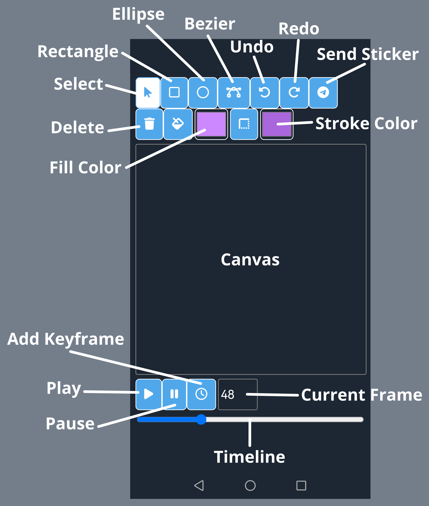

Glaximini
=========

This is a very basic animated sticker editor.

## Configuration

```json
{
    "apps": {
        "glaximini": {
            "class": "mini_apps.apps.glaximini.app.Glaximini",
            "bot-token": "(your bot token)",
            "url": "https://miniapps.example.com/glaximini/"
        }
    }
}
```

## Bot Setup

On [BotFather](https://t.me/BotFather), you'll need the following:

The menu button (`/mybots` > _@YourBotUsername_ > _Bot Settings_ > _Menu Button_), setting to the URL
to where you expose the mini events app (same as `url` in the settings json).

The app (`/newapp`), for "web app URL" use the URL as before.

And enable inline mode (`/setinline`).

## User Interface




**Select**: This tool allows you to move and edit the shapes, just click on a shape to select it, drag a shape to move it,
or drag on the handles of the selected shape to edit its properties.

**Rectangle** and **Ellipse**: These tools are very similar, you drag on the canvas to create the corresponding shape.

**Bezier**: This tools can create more complex shapes. Just click on the canvas to add vertices,
if you click on the starting point the shape will be closed. You can also click and drag to make the edges more curved.

**Undo**, **Redo**: Self explanatory.

**Send Sticker**: Selects a chat and sends the current animation as sticker there.

**Delete**: Delete the selected shape.

**Fill** and **Stroke** color: They show a color selector and that will change the style of the current shape.

**Canvas**: Here is where you see and edit the animation.

**Play** and **Pause**: They start and stop playback.

**Add Keyframe**: Adds a keyframe at the current frame for all the properties of the selected shape.


## Animating

To add animations to the selected shape, scroll on the timeline to the initial frame, then press the _Keyframe_ button.

This will add a keyframe at the selected time for all the properties of the selected object.

Then scroll the timeline to a different time, change some properties of the shape (for example, position or color) and
press the _Keyframe_ button again.

After that, pressing _Play_ should show your shape animating between those keyframes.


## Limitations

Currently it's limited to one animation per user, and the feature support is rather limited.
